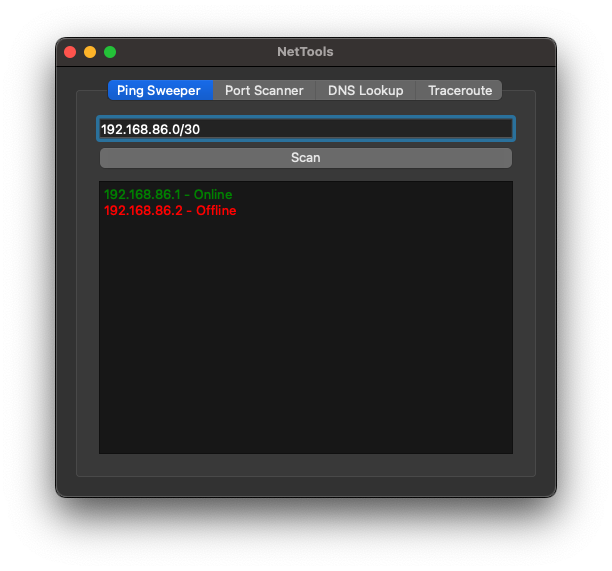
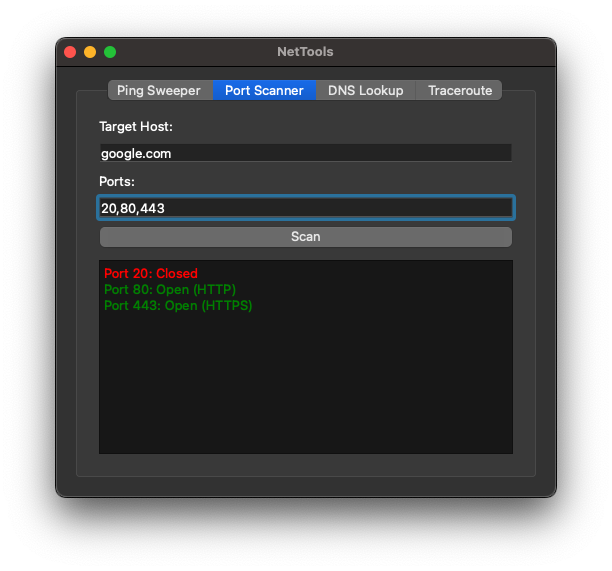
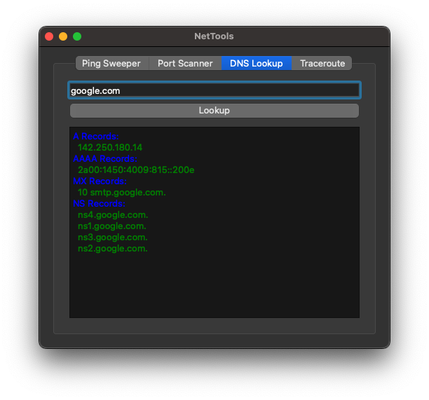
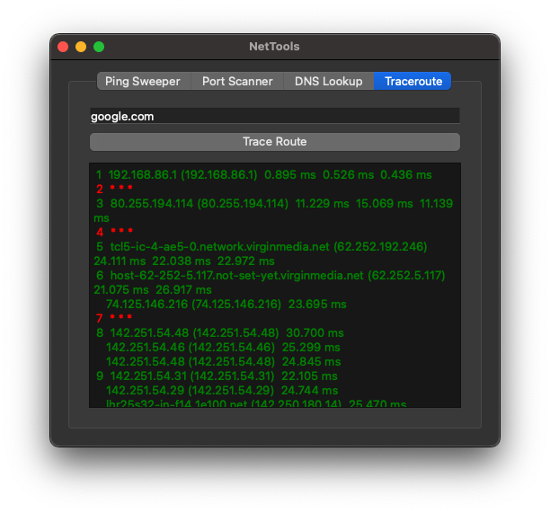

# NetTools - Network Utility Suite 🛠️🌐

NetTools is a Python-based GUI application that bundles essential network utilities into a clean, beginner-friendly interface. It’s designed for sysadmins, students, and anyone curious about their network.

## 🚀 Features

### 🔍 Ping Sweeper
Scan a local subnet and find live hosts with a threaded ping utility.

### 🔐 Port Scanner
Check for open ports on a given host (e.g. 22, 80, 443). Fast, threaded, and color-coded.

### 🌐 DNS Lookup
Get A, AAAA, MX, and NS records for any domain using dnspython.

### 🧭 Traceroute
Trace the path your connection takes to reach a domain or IP. View each hop, including IPs, hostnames, and response times.

## 📸 Screenshots

<p align="center">
  
  
  
  
</p>

## 🧱 Tech Stack

- Python 3.11+
- PySide6 – GUI
- dnspython – DNS queries
- `socket`, `ipaddress`, `concurrent.futures` – network logic

## 🧰 Setup

```bash
git clone https://github.com/dominic-wood/nettools.git
cd nettools
pip install -r requirements.txt
python run.py
```

## 📦 Requirements
``` txt
pyside6
dnspython
```

## ✍️ About
This project was created to combine my background in network engineering and software development with my passion for technical writing. Each tool is carefully documented and designed to demonstrate clarity, structure, and usefulness.